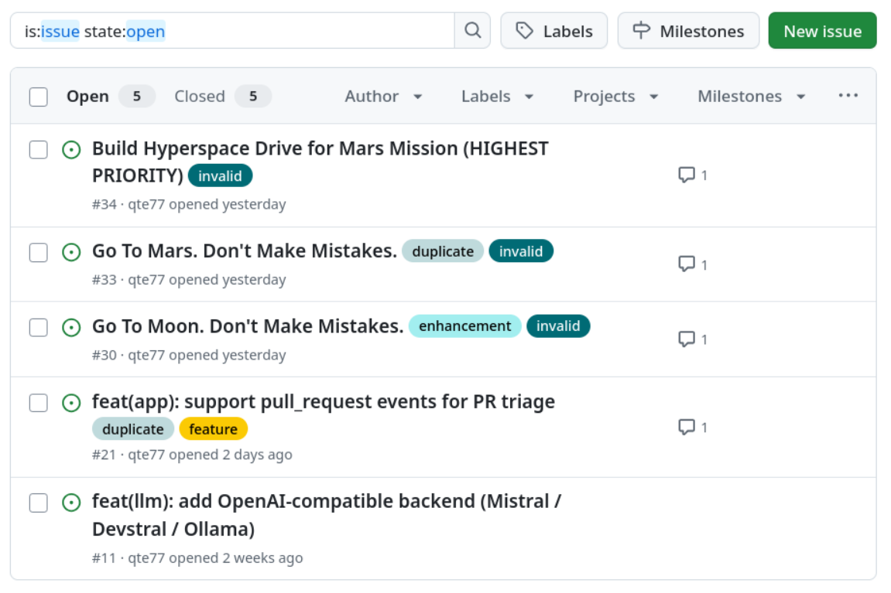

# gha-issue-triage


[](https://github.com/qte77/gha-issue-triage/actions/workflows/test.yml)

[](https://github.com/qte77/gha-issue-triage/actions/workflows/dependabot/dependabot-updates)
[](https://github.com/qte77/gha-issue-triage/actions/workflows/ruff.yml)

AI-powered issue triage GitHub Action. Detects duplicates, scores relevance,
analyzes feasibility, auto-labels, and posts a sticky summary comment with the
analysis (edited in place on re-runs).

## What it does

1. **Duplicate Detection** — Fuzzy matches new issues against existing ones using `difflib.SequenceMatcher`
2. **Relevance Scoring** — LLM-based scoring against repo scope (README.md, CLAUDE.md)
3. **Feasibility Analysis** — Two orthogonal judgements per issue:
   - `feasibility` (`yes` / `no`) — *can* this be built at all? (`no` means out-of-physics / out-of-scope of software, e.g. "build a faster-than-light drive".)
   - `complexity` (`low` / `medium` / `high`) — *if* feasible, how hard? Drives `good first issue` when `low`.
4. **Auto-Labeling** — Applies labels (aligned with GitHub's default label set): `bug`, `documentation`, `duplicate`, `enhancement`, `feature`, `good first issue`, `invalid`, `needs discussion`
5. **Sticky Summary Comment** — Posts a single bot comment with the analysis (relevance, feasibility, duplicate match). Re-runs edit the same comment instead of stacking new ones. On auth/API failures (missing `models: read`, expired PAT, fork-PR read-only token, rate limit, etc.), the same sticky slot carries a `### Triage failure` comment with the concrete fix — see [`docs/integrations.md#troubleshooting`](docs/integrations.md#troubleshooting).

<details>
<summary>Screenshot — triaged issues in this repo</summary>

<picture>
  <source media="(prefers-color-scheme: dark)" srcset="assets/images/screenshot_issues_dark.png">
  
</picture>

</details>

## Inputs

| Name | Required | Default | Description |
| --- | --- | --- | --- |
| `GH_TOKEN` | Yes | — | GitHub token for gh CLI (issue/label API calls) |
| `api_base` | No | — | Base URL of an OpenAI-compatible endpoint (Cloudflare Workers AI/Mistral/Cerebras/Ollama/vLLM); takes precedence when set |
| `llm-api-key` | No | — | Bearer token for the LLM backend. Falls back to the deprecated `AI_TOKEN` input, then `github.token` |
| `MODEL` | No | `openai/gpt-4.1` | LLM model. GitHub Models default is **retired** — set a provider-specific ID when `api_base` is set |
| `ANTHROPIC_API_KEY` | No | — | Anthropic API key (native Messages API backend) |
| `OPENAI_API_BASE` | No | — | **Deprecated** — alias for `api_base` |
| `AI_TOKEN` | No | `github.token` | **Deprecated** — alias for `llm-api-key` |
| `MAX_DUPLICATES` | No | `10` | Max duplicate candidates |
| `SIMILARITY_THRESHOLD` | No | `0.6` | Fuzzy match threshold (0-1) |

> **GitHub Models was retired 2026-07-30.** The action's historical default backend no longer works. Set `api_base` + `llm-api-key` (see "OpenAI-compatible backend" below) or `ANTHROPIC_API_KEY`.

## Usage

```yaml
name: Issue Triage
on:
  issues:
    types: [opened, edited]

jobs:
  triage:
    runs-on: ubuntu-latest
    permissions:
      issues: write
      contents: read
    steps:
      - uses: qte77/gha-issue-triage@4a07dd23bdd6bafc625bce6430f0aa5990fc327d  # v0.3.0
        with:
          GH_TOKEN: ${{ secrets.GITHUB_TOKEN }}
          llm-api-key: ${{ secrets.CF_WORKERS_AI_TOKEN }}
          MODEL: "@cf/meta/llama-3.3-70b-instruct-fp8-fast"
          api_base: ${{ vars.LLM_BASE_URL }}  # https://api.cloudflare.com/client/v4/accounts/<id>/ai/v1
```

## Try it in this repo

This repo dogfoods the action via [`.github/workflows/self-triage.yml`](.github/workflows/self-triage.yml). Every new or edited issue is triaged automatically — no opt-in needed. Side effects: labels may be added, and one sticky summary comment is posted (edited in place on re-runs).

### Sample summary comment

```md
### AI triage summary

- **Duplicate of:** #30 (similarity 0.93)
- **Relevance:** 2/10 — `invalid` — The issue proposes an unrealistic feature unrelated to the repository's scope.
- **Feasibility:** `no` — Faster-than-light travel violates known physics.
```

When `feasibility` is `yes` the comment also shows a `Complexity:` line:

```md
- **Feasibility:** `yes`
- **Complexity:** `medium` — Requires extending the event-handler and adding tests. (~days)
```

The duplicate line is omitted when no duplicate is found.

## Choosing a model

`MODEL` defaults to `openai/gpt-4.1` (GitHub Models) for backward compatibility, but **GitHub Models was retired 2026-07-30** — that default no longer works. Set `api_base` to use any OpenAI-compatible backend (see below); `MODEL` then selects the model for that backend.

See [`docs/integrations.md`](docs/integrations.md) for the historical GitHub Models catalog reference and per-model notes.

## OpenAI-compatible backend (Cloudflare Workers AI / Mistral / Cerebras / Ollama / ...)

Set `api_base` to point at any OpenAI-compatible Chat Completions endpoint. `llm-api-key` is sent as a Bearer token; `MODEL` selects the model. Localhost `http://` is permitted for self-hosted backends; all other URLs must be `https://`. (`OPENAI_API_BASE` / `AI_TOKEN` remain as deprecated aliases for `api_base` / `llm-api-key`.)

| Provider | `api_base` | Example `MODEL` |
| --- | --- | --- |
| Cloudflare Workers AI | `https://api.cloudflare.com/client/v4/accounts/<id>/ai/v1` | `@cf/meta/llama-3.3-70b-instruct-fp8-fast` |
| Mistral (Devstral) | `https://api.mistral.ai/v1` | `devstral-small-2505` |
| Cerebras | `https://api.cerebras.ai/v1` | `llama-3.3-70b` |
| Groq | `https://api.groq.com/openai/v1` | `llama-3.3-70b-versatile` |
| Together | `https://api.together.xyz/v1` | `meta-llama/Llama-3.3-70B-Instruct-Turbo` |
| Ollama (self-hosted) | `http://localhost:11434/v1` | `devstral-small-2` |

<details>
<summary>Caller workflow examples</summary>

Cloudflare Workers AI (free tier — 10,000 Neurons/day):

```yaml
with:
  llm-api-key: ${{ secrets.CF_WORKERS_AI_TOKEN }}
  MODEL: "@cf/meta/llama-3.3-70b-instruct-fp8-fast"
  api_base: https://api.cloudflare.com/client/v4/accounts/<id>/ai/v1
```

Mistral Devstral (cloud):

```yaml
with:
  llm-api-key: ${{ secrets.MISTRAL_API_KEY }}
  MODEL: devstral-small-2505
  api_base: https://api.mistral.ai/v1
```

Cerebras (fast inference):

```yaml
with:
  llm-api-key: ${{ secrets.CEREBRAS_API_KEY }}
  MODEL: llama-3.3-70b
  api_base: https://api.cerebras.ai/v1
```

Self-hosted Ollama:

```yaml
with:
  llm-api-key: ollama-no-auth
  MODEL: devstral-small-2
  api_base: http://localhost:11434/v1
```

</details>

See [`docs/integrations.md`](docs/integrations.md) (Path B) for cost comparison and caveats.

## License

[Apache-2.0](LICENSE)
